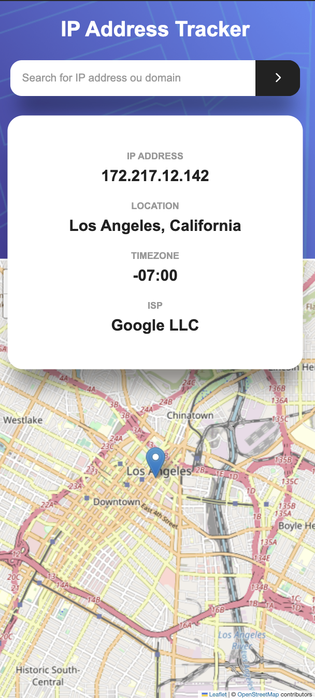

# IP Tracker

# Introduction

This project was found on frontendmentor.io which is a website I use to find good challenging project to complete to sharpen my skills as a software developper.

# Goal

The goal of the prject was to build an ip tracker web app and get familiar with geolocalisation technologies.

# How it works 

Users enter a domain or a valid ip address and get the IP Address, Location, Timezone and ISP of the input and get to see the location on the map.

